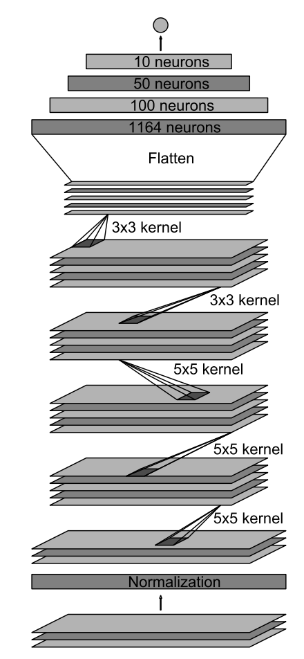

#**Behavioral Cloning** 

---

**Behavrioal Cloning Project**

The goals / steps of this project are the following:

* Use the simulator to collect data of good driving behavior
* Build, a convolution neural network in Keras that predicts steering angles from images
* Train and validate the model with a training and validation set
* Test that the model successfully drives around track one without leaving the road
* Summarize the results with a written report

## Rubric Points
###Here I will consider the [rubric points](https://review.udacity.com/#!/rubrics/432/view) individually and describe how I addressed each point in my implementation.  

---
###Files Submitted & Code Quality

####1. Submission includes all required files and can be used to run the simulator in autonomous mode

My project includes the following files:

* model.py containing the script to create and train the model
* drive.py for driving the car in autonomous mode
* model.h5 & model.json containing a trained convolution neural network 
* README.pdf summarizing the results

####2. Submssion includes functional code
Using the Udacity provided simulator and my drive.py file, the car can be driven autonomously around the track by executing 

```sh
python drive.py model.json
```

####3. Submssion code is usable and readable

The model.py file contains the code for training and saving the convolution neural network. The file shows the pipeline I used for training and validating the model, and it contains comments to explain how the code works.

###Model Architecture and Training Strategy

####1. An appropriate model arcthiecture has been employed

My model consists of a convolution neural network with 3x3 filter sizes or 5x5 filter sizes.

The model includes RELU layers to introduce nonlinearity, and the data is normalized in the model using a Keras lambda layer.

####2. Attempts to reduce overfitting in the model

The model was trained and validated on different data sets to ensure that the model was not overfitting. 

The model is trained on dataset three times(EPOCH=3), if it's too large, the model'll overfit.

The model was tested by running it through the simulator and ensuring that the vehicle could stay on the track. My model works well on both of the two tracks.

####3. Model parameter tuning

The model used an adam optimizer, so the learning rate was not tuned manually (model.py line 118).

####4. Appropriate training data

Training data was chosen to keep the vehicle driving on the road. I used a combination of center lane driving, recovering from the left and right sides of the road ... 

For details about how I created the training data, see the next section. 

###Model Architecture and Training Strategy

####1. Solution Design Approach

Design a model is pretty easy. My model is based on [this paper](https://images.nvidia.com/content/tegra/automotive/images/2016/solutions/pdf/end-to-end-dl-using-px.pdf).

The most difficult part is how to process the data. After the preprocess, others(like overfitting, architecture) won't be a problem. For detail, please see below.

####2. Final Model Architecture

Here is a visualization of the architecture 



There're five convolution layer(line 89~104). The filter size & depth:

- 24@5*5
- 36@5*5
- 48@5*5
- 64@3*3
- 64@3*3

Then there're five fully-connected layer(line 106~116), just like the image.


The final model architecture (model.py lines 18-24) consisted of a convolution neural network with the following layers and layer sizes ...

####3. Creation of the Training Set & Training Process

I use the dataset which is provided by Udacity.

Here are some steps I used to preprocess the data.

**A.** There're three camera in the car. So there're three kinds of images in our dataset. For center image, we can just use them. For left images, we add 0.22 to the corresponding steering. And for right images, we add -0.22 to the corresponding steering.

**B.** If you see the driving_log.csv file, most of the steering is 0. But it doesn't means we should go straight in such situation. So we randomly shared the image. Then there won't be too much images with 0 steerings.

**C.** There're too many background in the image. For example, mountain, tree, and etc. We won't care them. So I remove 35 percent of the image from top, and 10 percent of the image from bottom.

**D.** Most of our data is trun left. So we randomly flip the image in horizontal direction. Then our model'll know more about turn right.

**E.** I resized the image to 128*128

I use 20032 images for training, 6400 images for validation.

The accuracy of training is similar with accuracy of validation. So no overfitting.